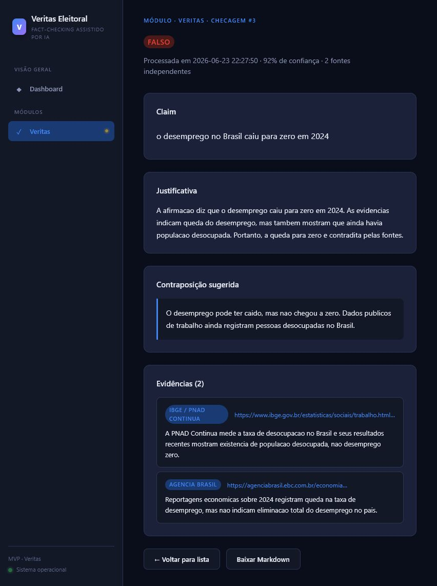

<div align="center">



<br/>

# Veritas Eleitoral

**PT:** MVP de fact-checking eleitoral com IA aplicada, fila de processamento e dossie rastreavel  
**EN:** Electoral fact-checking MVP with applied AI, background processing and traceable dossier generation

<br/>

[](https://python.org)
[](LICENSE)
[](https://github.com/simoesleandro/veritas-eleitoral/commits)
[](https://github.com/simoesleandro/veritas-eleitoral/issues)
[](https://flask.palletsprojects.com)
[](https://www.langchain.com/langgraph)
[](https://aistudio.google.com)

<br/>

[📄 Repositorio](https://github.com/simoesleandro/veritas-eleitoral) &nbsp;·&nbsp;
[🐛 Reportar bug](https://github.com/simoesleandro/veritas-eleitoral/issues) &nbsp;·&nbsp;
[💡 Sugerir feature](https://github.com/simoesleandro/veritas-eleitoral/issues)

</div>

---

## 📋 Indice / Table of Contents

- [Sobre / About](#-sobre--about)
- [Por que importa / Why it matters](#-por-que-importa--why-it-matters)
- [Competencias demonstradas / Skills demonstrated](#-competencias-demonstradas--skills-demonstrated)
- [Demo](#-demo)
- [Funcionalidades / Features](#-funcionalidades--features)
- [Como funciona / How it works](#-como-funciona--how-it-works)
- [Stack](#-stack)
- [Instalacao / Setup](#-instalacao--setup)
- [Uso / Usage](#-uso--usage)
- [Arquitetura / Architecture](#-arquitetura--architecture)
- [Testes / Tests](#-testes--tests)
- [O que aprendi / What I learned](#-o-que-aprendi--what-i-learned)
- [Roadmap](#-roadmap)
- [Status](#-status)
- [Autor / Author](#-autor--author)

---

## 📌 Sobre / About

**PT:**  
Veritas Eleitoral e um MVP de fact-checking eleitoral assistido por IA. O fluxo recebe uma claim politica, extrai afirmacoes verificaveis, pesquisa evidencias em fontes publicas e bases de fatos, classifica o veredito e registra um dossie de checagem com rastreabilidade.

Este repositorio nasceu como um recorte enxuto do EleitorAI. A ideia original era ampla demais para funcionar bem como projeto de portfolio; aqui o foco e um produto menor, demonstravel, testavel e facil de explicar.

**EN:**  
Veritas Eleitoral is an electoral fact-checking MVP assisted by AI. The workflow receives a political claim, extracts verifiable statements, searches for evidence in public sources and fact databases, classifies the verdict and records a traceable checking dossier.

This repository was extracted from the broader EleitorAI idea. The original scope was too wide for a clear portfolio project; here the focus is a smaller, demonstrable and testable product.

---

## 🎯 Por que importa / Why it matters

**PT:**  
Campanhas, jornalistas locais, pesquisadores e equipes civicas precisam responder rapidamente a afirmacoes falsas ou enganosas. O Veritas Eleitoral organiza esse fluxo em uma aplicacao web simples: entrada manual da claim, processamento em fila, analise por IA, evidencias auditaveis e historico de checagens.

O objetivo nao e automatizar "a verdade". O valor do produto esta em estruturar triagem, contexto e rastreabilidade para acelerar verificacoes humanas.

**EN:**  
Campaign teams, local journalists, researchers and civic groups often need to respond quickly to false or misleading claims. Veritas Eleitoral organizes that workflow into a simple web application: manual claim entry, queued processing, AI-assisted analysis, auditable evidence and check history.

The goal is not to automate "truth". The value lies in structuring triage, context and traceability to support faster human verification.

---

## 🧠 Competencias demonstradas / Skills demonstrated

| Area / Area | Evidencia no projeto / Evidence |
|-------------|---------------------------------|
| Product scoping | Transformacao de uma ideia ampla em MVP explicavel e testavel |
| Backend Python | Flask app, rotas de dashboard, autenticacao e fluxo de submissao |
| IA aplicada | Extracao, pesquisa, verificacao e redacao com agentes especializados |
| Orquestracao | Pipeline separado entre web app, core de dominio e worker de background |
| Dados | SQLite, schema relacional para claims, evidencias, alertas, fila e dossies |
| RAG / retrieval | `sqlite-vec`, embeddings e retriever local para apoio contextual |
| Testes | Pytest cobrindo core, agentes, pipeline, scrapers e ferramentas |

---

## 🎬 Demo


A demo acima usa uma claim controlada:

> "O candidato afirmou que o desemprego no Brasil caiu para zero em 2024."

O fluxo extrai a afirmacao principal, associa evidencias, classifica o veredito como `falso` e gera uma contraposicao sugerida.

---

## ✨ Funcionalidades / Features

- ✅ Dashboard com KPIs de mencoes, checagens, alertas e fila
- ✅ Formulario para submeter claims eleitorais manualmente
- ✅ Modo demo deterministico para apresentacao e screenshots
- ✅ Pipeline Veritas com extracao, pesquisa, verificacao e redacao
- ✅ Worker separado para processar checagens em background
- ✅ Base SQLite com `sqlite-vec` para apoio a RAG
- ✅ Alertas para claims falsas ou enganosas
- ✅ Download do dossie em Markdown
- ✅ Testes automatizados para core, agentes, scrapers e ferramentas
- 🚧 Deploy demonstrativo ainda pendente
- 🚧 Exportacao de dossies em PDF planejada

---

## 🧩 Como funciona / How it works

O pipeline principal separa responsabilidades para manter o projeto pequeno e rastreavel:

1. **Entrada:** uma claim e submetida pela interface web.
2. **Fila:** a checagem vira job para processamento assincorno.
3. **Extracao:** o agente extrator identifica afirmacoes verificaveis.
4. **Pesquisa:** o agente pesquisador cruza fontes publicas e bases de fatos.
5. **Verificacao:** o verificador classifica o veredito com base nas evidencias.
6. **Redacao:** o redator organiza o dossie final com contexto e contraponto.
7. **Historico:** a aplicacao registra o resultado, alertas e artefatos da checagem.

---

## 🛠 Stack

| Camada / Layer | Tecnologia / Technology |
|----------------|------------------------|
| Backend | Python 3.11+, Flask |
| Banco / Database | SQLite + `sqlite-vec` |
| Validacao | Pydantic |
| IA / AI | Google Gemini API |
| Orquestracao | LangGraph |
| Jobs | Worker dedicado + fila interna |
| Agendamento | APScheduler |
| Testes / Tests | pytest |

---

## 🚀 Instalacao / Setup

### Pre-requisitos / Prerequisites

- Python 3.11+
- pip
- Chave Gemini em [aistudio.google.com](https://aistudio.google.com)

### Instalacao / Installation

```powershell
python -m venv .venv
.\.venv\Scripts\Activate.ps1
pip install -r requirements.txt
Copy-Item .env.example .env
```

Edite `.env` e preencha:

```env
GEMINI_API_KEY=sua_chave
SECRET_KEY=uma_chave_local
DB_PATH=data/veritas_eleitoral.db
```

Inicialize o banco:

```powershell
python -c "from core.db import init_db; init_db()"
```

---

## 💻 Uso / Usage

### Rodar a aplicacao

```powershell
flask --app app run --debug
```

### Processar fila em outro terminal

```powershell
python -m worker --once
```

### Rodar o modo de demo controlada

```powershell
python -m veritas.demo
```

---

## 🏗 Arquitetura / Architecture

```text
veritas-eleitoral/
├── app/                   # Flask app, rotas e templates
├── core/                  # Config, DB, fila, LLM, logging, RAG
├── veritas/
│   ├── agentes/           # Extrator, pesquisador, verificador, critico, redator
│   ├── ferramentas/       # TSE, transparencia, noticias, ibge, datasus...
│   ├── scrapers/          # Integracoes com bases de fatos
│   ├── pipeline.py        # Orquestracao da checagem
│   ├── dossie.py          # Geracao do dossie
│   └── demo.py            # Demo controlada
├── worker/                # Processamento em background
├── tests/                 # Core, agentes, ferramentas e scrapers
└── docs/assets/           # Screenshots do projeto
```

**Fluxo principal / Main flow:**

```text
Claim enviada pela UI
      ↓
Fila interna / job
      ↓
Extrator → Pesquisador → Verificador → Redator
      ↓
SQLite + dossie de checagem
      ↓
Dashboard / historico / alertas
```

---

## 🧪 Testes / Tests

```powershell
pytest tests/core tests/veritas -q
```

Ou rode toda a suite:

```powershell
pytest
```

Cobertura atual inclui:
- core de configuracao, DB, fila e LLM
- agentes de extracao, pesquisa, verificacao, critica e redacao
- scrapers de bases de fatos
- ferramentas de fontes publicas

---

## 📚 O que aprendi / What I learned

- Recortar escopo sem perder identidade de produto.
- Separar web app, dominio, pipeline de IA e worker para manter o sistema explicavel.
- Usar IA generativa com validacao estruturada e etapas especializadas.
- Trabalhar com evidencias e rastreabilidade em vez de respostas "magicas".
- Construir um README mais orientado a portfolio e demonstracao real.

---

## 🗺 Roadmap

- [x] MVP de fact-checking com fluxo completo de checagem
- [x] Worker separado para processamento em background
- [x] Demo controlada para apresentacao
- [x] Base vetorial local com `sqlite-vec`
- [x] Testes do core e dos agentes principais
- [ ] Seed inicial mais robusta para fontes publicas confiaveis
- [ ] Exportacao de dossies em PDF
- [ ] Tela de detalhe com rastreabilidade completa das evidencias
- [ ] Exemplos reais de claims para demonstracao
- [ ] Deploy demonstrativo com dados ficticios

---

## 📌 Status

MVP em consolidacao. O objetivo atual e manter o projeto pequeno, funcional e apresentavel antes de ampliar cobertura de fontes ou automacoes adicionais.

---

## 👤 Autor / Author

<div align="center">

**Leandro Simoes**

[](https://linkedin.com/in/leandro-sim%C3%B5es-7a0b3537b)
[](https://github.com/simoesleandro)
[](https://simoesleandro.github.io/portfolio)

*Fullstack · IA Aplicada · Civic Tech*

</div>

---

<div align="center">

Feito com IA e criterio de produto em / Made with AI and product thinking in Rio de Janeiro

</div>
